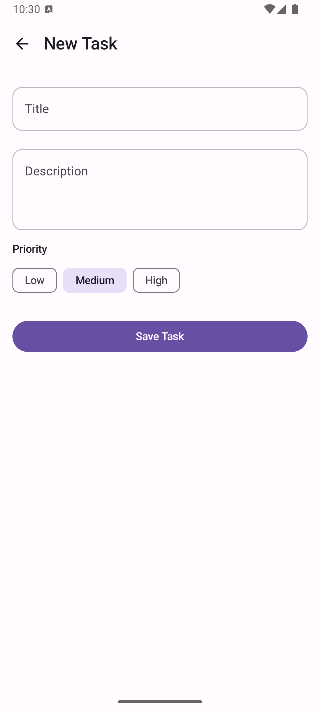
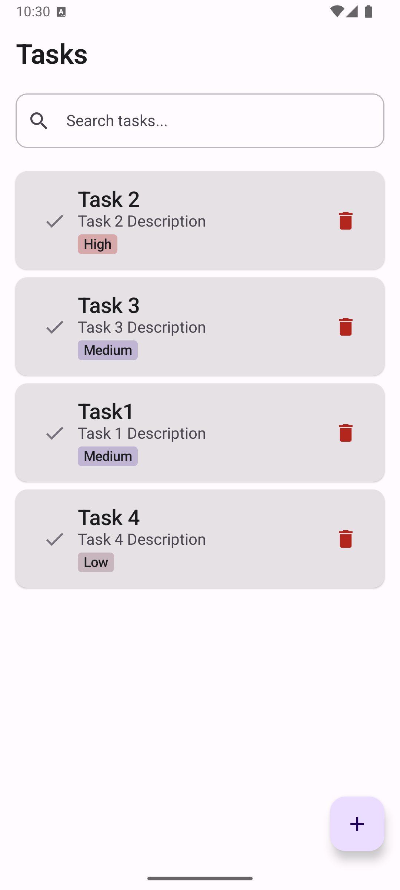
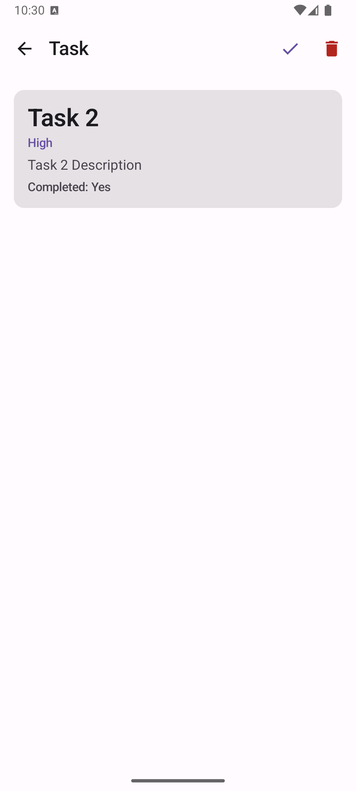
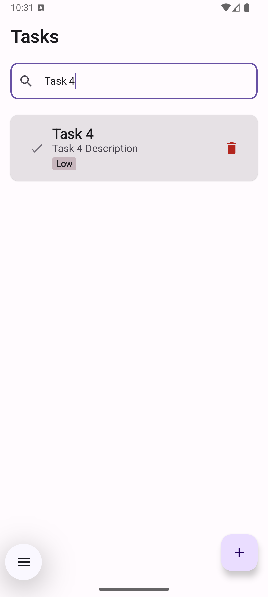

# Compose Showcase — Senior-Level Jetpack Compose + MVVM

A **showcase Android app** built with **Jetpack Compose** and **MVVM**. Uses a single-activity Compose UI, Room, Hilt, and a clear layered architecture.

## Screenshots

<p align="center">
  
  
  
  
</p>

## What This Showcase Demonstrates

### Architecture (MVVM + Clean separation)
- **Model**: Domain models (`Task`, `TaskPriority`) and data entities (`TaskEntity`) kept separate.
- **View**: Pure Compose UI; no logic in composables beyond calling ViewModel.
- **ViewModel**: UI state via `StateFlow`, one-way data flow, use cases for business operations.

### Tech Stack
| Layer        | Technology |
|-------------|------------|
| UI          | Jetpack Compose, Material 3, Navigation Compose |
| State       | `StateFlow` + `collectAsState()` |
| DI          | Hilt (ViewModel and Repository scoping) |
| Local DB    | Room (DAO, DB, migrations-ready) |
| Async       | Kotlin Coroutines + Flow |
| Architecture| Repository pattern, Use cases (domain layer) |

### Senior-Level Practices
1. **Single source of truth**: Repository abstracts data; ViewModels never touch Room/DAO directly.
2. **Reactive streams**: `Flow` from DAO → Repository → Use case → ViewModel → UI.
3. **Use cases**: One responsibility per use case (GetAllTasks, SearchTasks, AddTask, etc.).
4. **Scoped ViewModels**: `hiltViewModel()` per Nav graph destination so each screen has correct scope (e.g. detail screen for a specific `taskId`).
5. **UI state modeling**: Dedicated `*UiState` data classes (loading, error, content).
6. **Navigation**: Type-safe route constants and `NavHost` with arguments (`taskId`).
7. **Dependency injection**: Interface for repository in domain, implementation in data; Hilt modules for DB and DAO.

## Project Structure

```
app/src/main/java/com/showcase/app/
├── data/
│   ├── local/           # Room: entities, DAO, Database
│   └── repository/      # Repository implementations
├── di/                  # Hilt modules
├── domain/
│   ├── model/           # Domain models
│   ├── repository/      # Repository interfaces
│   └── usecase/         # Use cases
├── ui/
│   ├── addtask/         # Add task screen + ViewModel
│   ├── navigation/      # Nav routes + NavHost
│   ├── taskdetail/      # Task detail screen + ViewModel
│   ├── tasklist/        # Task list screen + ViewModel
│   └── theme/           # Material 3 theme + typography
├── MainActivity.kt
└── ShowcaseApplication.kt
```

## How to Run

### Option A: Android Studio (easiest)
1. Open the project in Android Studio (Hedgehog or newer recommended).
2. Let Android Studio create `local.properties` with your SDK path (or set **Settings → Android SDK** and note the path).
3. Sync Gradle and run on an emulator or device (API 26+).

### Option B: Command line
Gradle needs the Android SDK path. Use either **ANDROID_HOME** or a **local.properties** file.

**Using ANDROID_HOME** (no `local.properties` needed):
```bash
# Default SDK path when installed via Android Studio on macOS:
export ANDROID_HOME=$HOME/Library/Android/sdk
# If your SDK is elsewhere, use that path instead (e.g. from Android Studio → Settings → Android SDK).

./gradlew installDebug
```

**Using local.properties** (so you don’t set ANDROID_HOME every time):
```bash
# Create the file (use your actual SDK path; common on macOS: $HOME/Library/Android/sdk)
echo "sdk.dir=$HOME/Library/Android/sdk" > local.properties
./gradlew installDebug
```

If you see *"SDK location not found"*, the path in `local.properties` or `ANDROID_HOME` is wrong or the SDK isn’t installed. Install the SDK via Android Studio (**Tools → SDK Manager**) and use the path shown there.

## Features Implemented

- **Task list**: Loads from Room, shows priority and completion.
- **Search**: Reactive search over title/description via Flow.
- **Add task**: Form with title, description, priority; validation and error state.
- **Task detail**: View task, toggle complete, delete (with back navigation).
- **Persistence**: All data stored in Room; survives process death.

## Possible Extensions (for further showcase)

- Add **RemoteMediator** or offline-first with a remote API.
- Add **unit tests** for ViewModels and use cases.
- Add **UI tests** with Compose Testing.
- Add **saved state** for search query (e.g. `SavedStateHandle`).
- Add **exportSchema = true** and migration tests for Room.

---

Built to demonstrate **Jetpack Compose**, **MVVM**, **Hilt**, **Room**, and **Clean Architecture** at a senior Android level.
